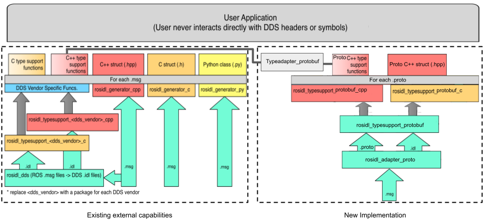

# Protobuf ROS Interface Design
## Abstract
This project provides the ability to publish and subscribe with Protobuf Datatypes to ROS native publishers and subscribers. So the user could work with the ROS native messages or use the Protobuf Datatypes.

## Example Usage

#### Dependencies

* The type adapter that allows the user to publish from native ROS message or Protobuf data type
    ```cpp
    #include "rclcpp/type_adapter.hpp"
    ```

* Next include the message to publish-subscribe, for example, a `string` message from `std_msgs`.
    ```cpp
    #include "std_msgs/msg/string.hpp"
    #include "std_msgs/msg/String.pb.h"
    ```

* Finally, include the type adapter for the Protobuf data type message.
    ```cpp
    #include "std_msgs/rosidl_adapter_proto__visibility_control.h"
    #include "std_msgs/msg/string__typeadapter_protobuf_cpp.hpp"
    ```
#### Publisher Example
```cpp
using MyAdaptedType = rclcpp::TypeAdapter<std_msgs::msg::pb::String, std_msgs::msg::String>;
publisher_ = this->create_publisher<MyAdaptedType>("topic", 10);
```
To publish a message, it is only required to specify the adapter type to send the topic.

#### Subscriber Example
```cpp
using MyAdaptedType = rclcpp::TypeAdapter<std_msgs::msg::pb::String, std_msgs::msg::String>;
subscription2_ = this->create_subscription<MyAdaptedType>(
     "topic", 10, std::bind(&MinimalSubscriber::topic_callback2, this, _1));
void topic_callback2(const std_msgs::msg::pb::String & msg) const
 {
   RCLCPP_INFO(this->get_logger(), "I heard Proto: '%s'", msg.data().c_str());
 }
```
To subscribe to the topic the user needs to specify the adapter type, and for the callback specify the protobuf message to hear the message received.

Another path to hear the message is using the ROS types messages:

```cpp
subscription_ = this->create_subscription<std_msgs::msg::String>(
     "topic", 10, std::bind(&MinimalSubscriber::topic_callback, this, _1));
void topic_callback(const std_msgs::msg::String & msg) const
 {
   RCLCPP_INFO(this->get_logger(), "I heard: '%s'", msg.data.c_str());
 }

```

## Concepts
## Type Specific Interface
The following diagram shows the system to perform type-specific functions to support .msg and .proto files. 

 <p align="center">
        
       </p>

The left-hand side of the diagram shows how the .msg files are passed to the specific code generators (using vendors or rosidl_generator). The other side shows how the .proto files are passed to the code generators. Finally, the Type adapter block converter from one type to another (proto to msg, or .msg to proto), see [About-Internal-Interfaces](https://docs.ros.org/en/humble/Concepts/Advanced/About-Internal-Interfaces.html) for more information. 


## Specification
#### Type Adapter
To adapt the prototype message to a ROS type, protobuf type support generates a specialization for the proto message. The specialization has the following:
* is_specialized is always set to  std::true_type,
* Specify the proto custom type using custom =
* Specify the ROS type using ros_message
* Provide static convert functions with the signatures:
  * static void convert_to_ros_message(const custom_type &, ros_message_type &),
  * static void convert_to_custom(const ros_message_type &, custom_type &)


The convert function must convert from one type to the other, see [Type Adaptation Feature](https://ros.org/reps/rep-2007.html) for more information.

For example, the specialization for adapting std_msgs::msg::pb::String to the std_msgs_msg::String ROS message type:

```cpp
template<>
 struct TypeAdapter<::std_msgs::msg::pb::String,  ::std_msgs::msg::String>
 {
   using is_specialized = std::true_type;
   using custom_type = ::std_msgs::msg::pb::String;
   using ros_message_type =  ::std_msgs::msg::String;


   static
   void
   convert_to_ros_message(
    const custom_type & source,
    ros_message_type & destination)
   {
    std_msgs::msg::typesupport_protobuf_cpp::convert_to_ros(source, destination);
   }


   static
   void
   convert_to_custom(
     const ros_message_type & source,
     custom_type & destination)
   {
     std_msgs::msg::typesupport_protobuf_cpp::convert_to_proto(source, destination);
   }
 };

```

#### Mapping from IDL -> Protobuf Type:
This adapter also mapping from IDL types to Protobuf type.
[IDL to Protobuf type.](rosidl_adapter_proto/rosidl_adapter_proto/__init__.py)